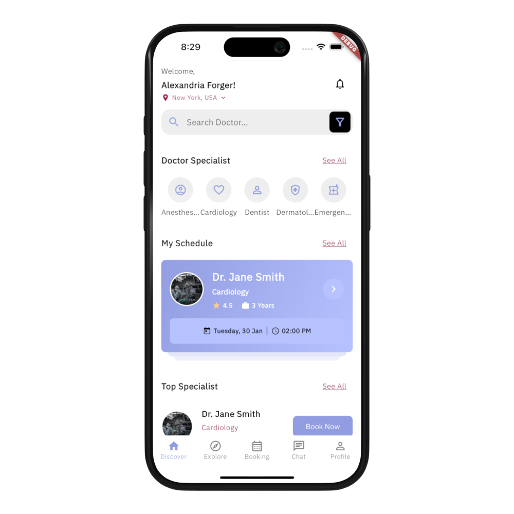
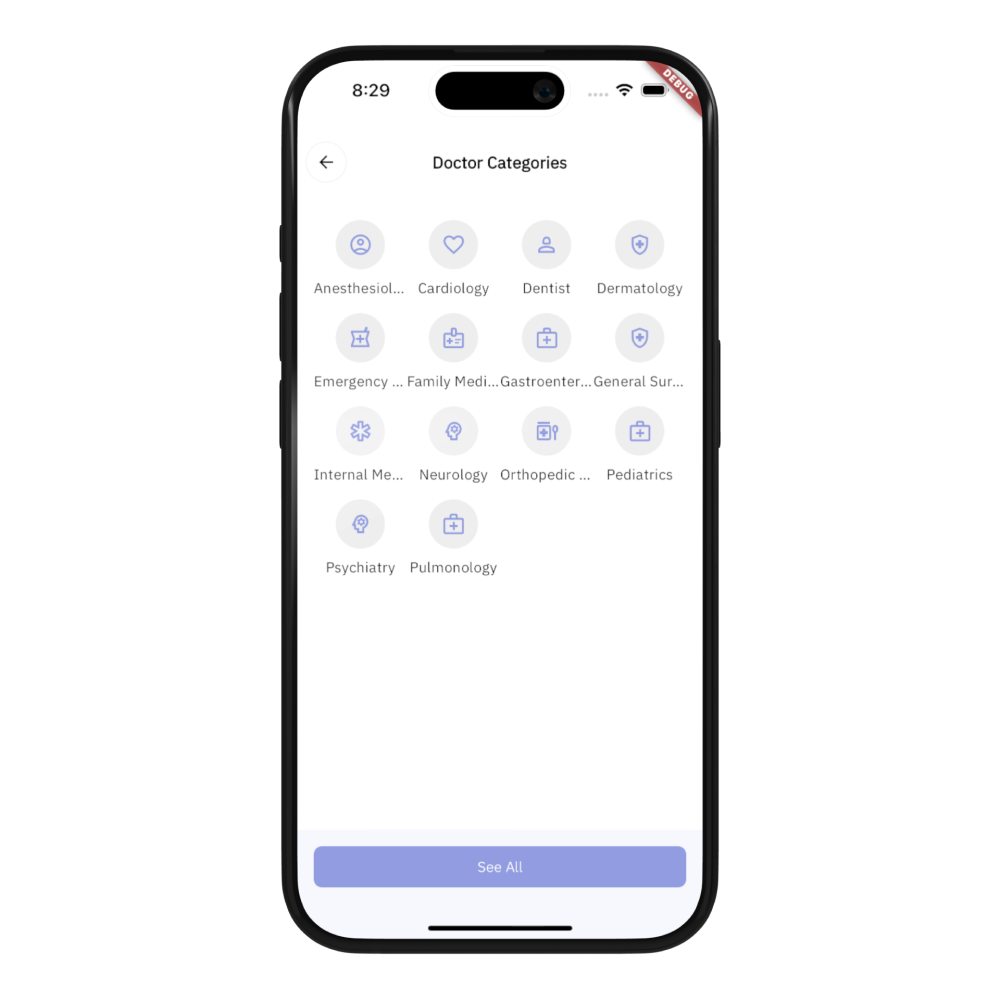
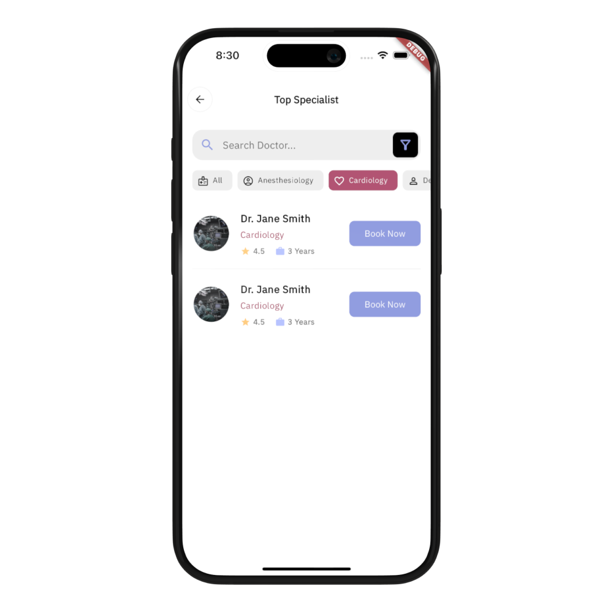
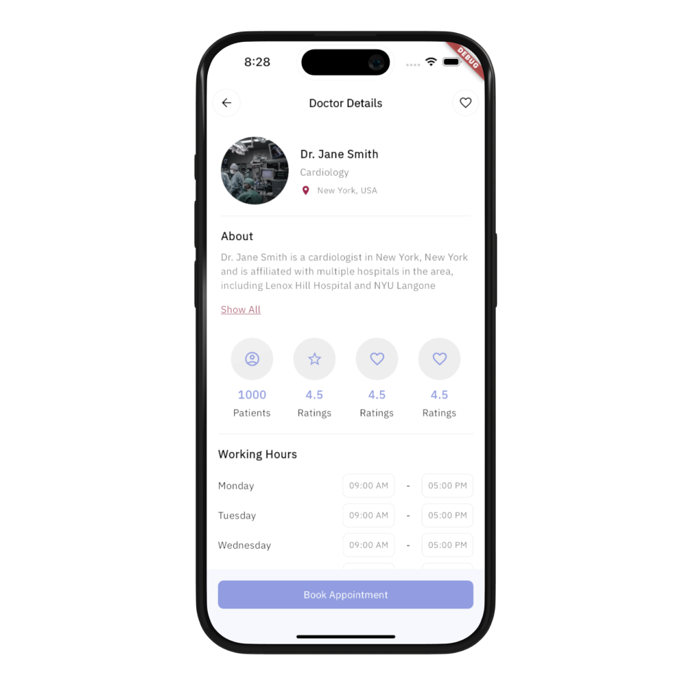
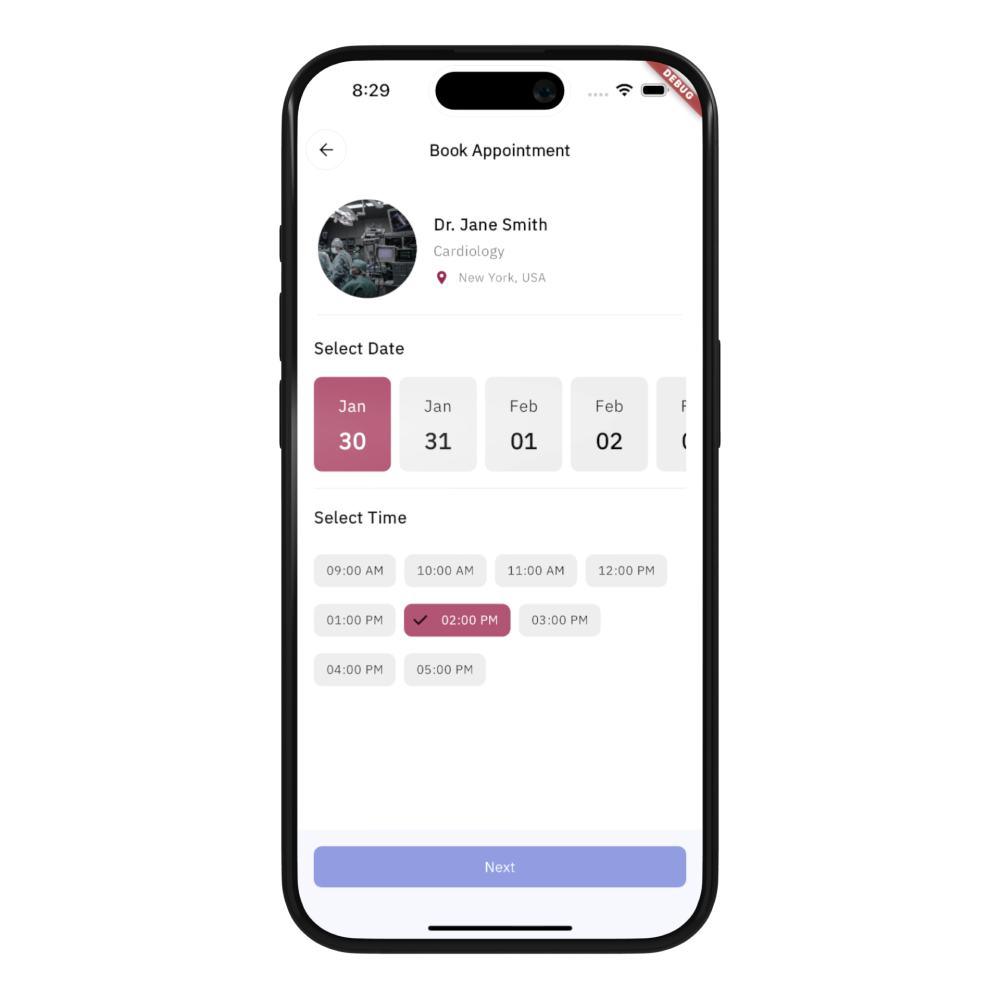
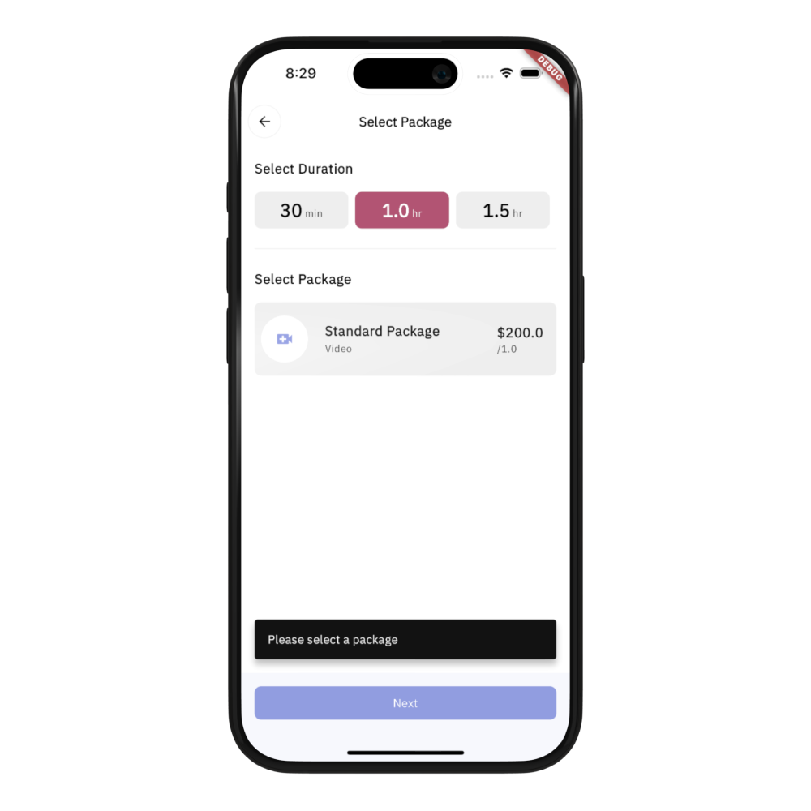
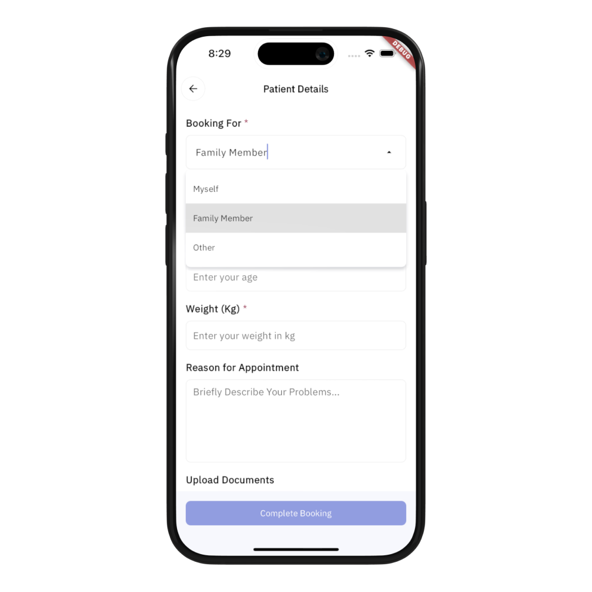

# Doctor Booking App with Flutter
The Doctor Booking App template is built with Flutter and gives you a modern UI to handle the process of scheduling and managing appointments for both patients and healthcare providers. This template is a starting point for developers looking to create a doctor booking app without building everything from scratch.


## Screens & UI Elements
Currently, the template includes seven screens:
- **Home screen**
- **Doctor list screen**
- **Doctor details screen**
- **Doctor categories screen**
- **Book appointment: Select date & time screen**
- **Book appointment: Select package screen**
- **Book appointment: Patient details screen**

## Screenshots
| |  |  |
|:---:|:---:|:---:|
| Home Screen | Categories Screen | Catalog Screen |
|  |  |  |
| Cart Screen | Checkout Screen | Product Screen|
|  |  |  |
| User Account Screen |  |  |


## Features & Functionalities:
The existing codebase enables users to perform a variety of actions, including:
- Viewing a list of doctor categories and navigating to the doctor listing page for the category.
- Browsing a list of doctors and filtering the list based on the category.
- Viewing the doctor profile with the details and the working hours information. 
- Creating a new appointment by selecting a doctor, package, time and by adding all the required personal information via dropdowns and text form fields. 
- Seeing a reminder of the next, upcoming appointment with the doctor. 

<br />
If you're wondering how these feature are implemented in the template. Here's some details about the app's functionalities.

### State Management
The template uses the BLoC Pattern to separate the UI from the business logic. The app uses the flutter_bloc library to create BLoC (and/or Cubit) to handle inputs from the user and the application lifecycle and to present the data to the screens. Currently, it includes four BLoCs/cubits:
- **Home BLoC**: Handles the retrieval of the appointments, doctors and clinics information and makes those information available to the Home Screen. 
- **Doctor List BLoC**: Fetches a list of doctors based on the user selection, stores the data in its state and provides them to the UI. 
- **Doctor Details BLoC**: Same as the Doctor List BLoC, but, for one specific doctor selected by the user. 
- **Book Appointment BLoC**: Controls and stores the inputs received by the user throughout the booking process (from package selection to age/gender inputs), and finally, starts the process to create a new booking. 


### Database Client (packages/db_client)
The template has a local package to handle the interaction with a database. The package has a local in-memory implementation with a fake data source that contains the sample data to run the application. 

### Navigation
The navigation between screens is implemented using GoRouter. 

### Localization (l10n)
The template is designed with global accessibility in mind. It utilizes the flutter_localizations package that enables the localization of strings and various values to target multiple languages and locales. All the app's hardcoded strings are initially provided in English and added in the lib/l10n/app_en.arb file. Optionally, you can include additional translations based on your specific requirements. 


## Getting Started
To run the template, follow these steps. 

### Step 1: 
- Go to the root level of the project. Then, add the dependencies: 
```dart
flutter pub get
```

### Step 2: 
- Start the iOS simulator or the Android emulator, and run the application:
```dart 
flutter run
```
