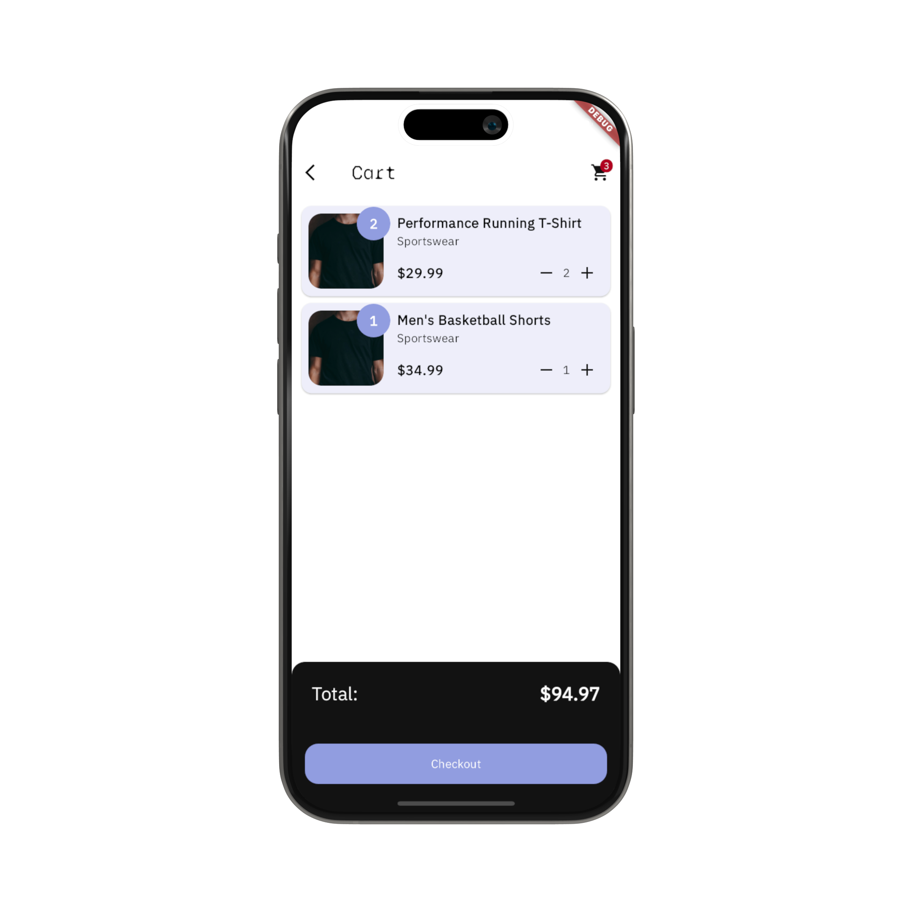
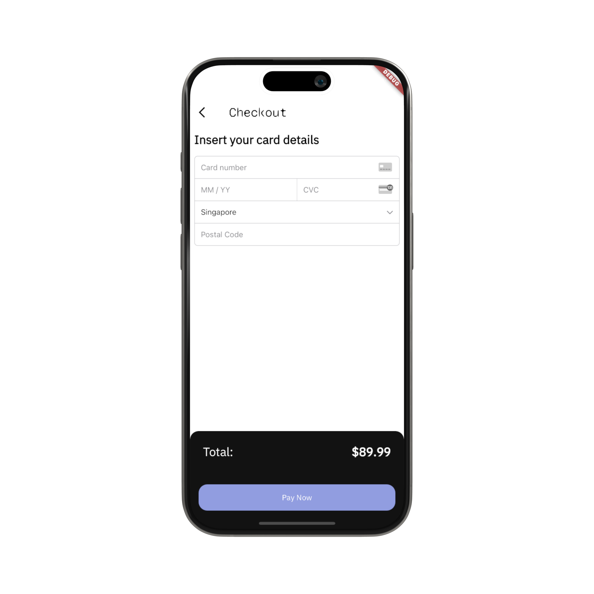
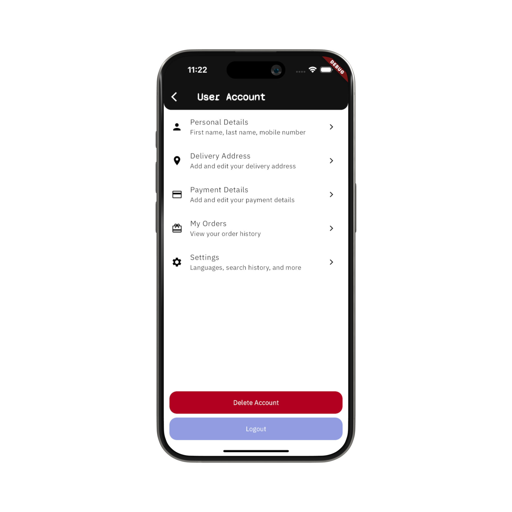
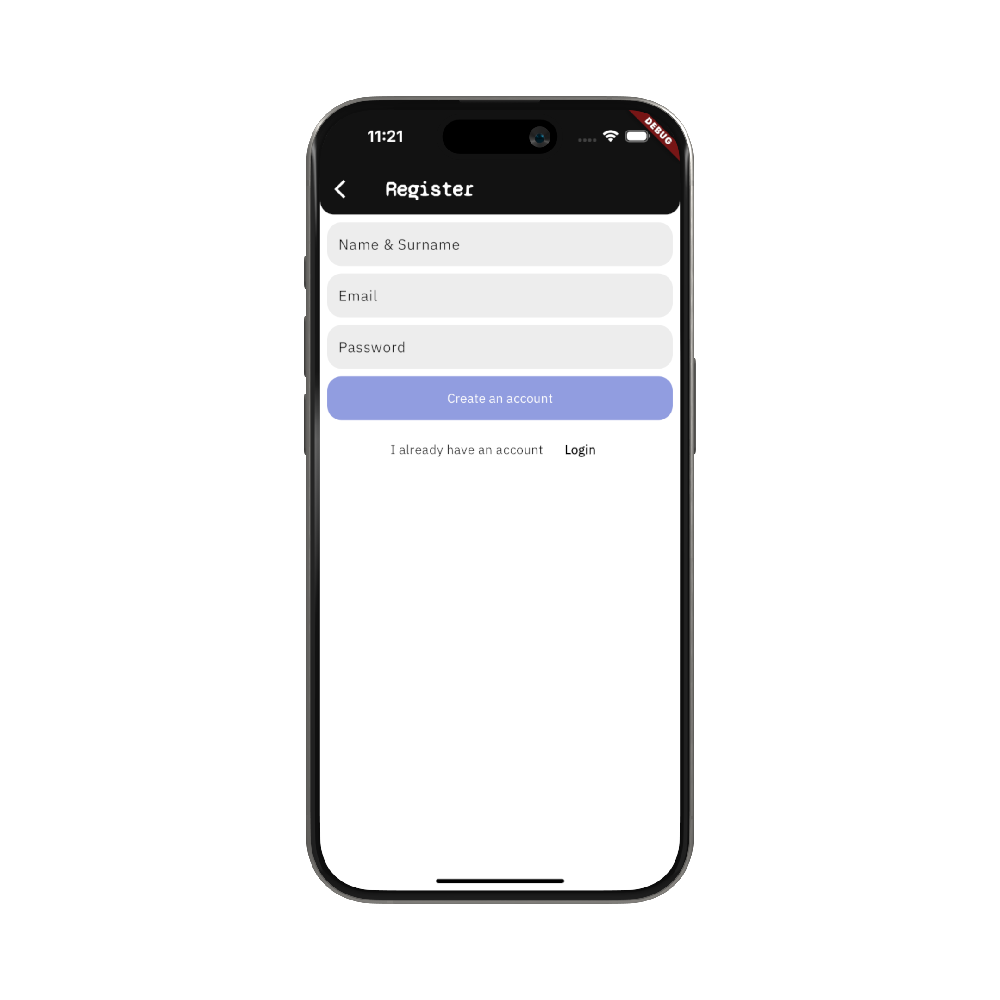
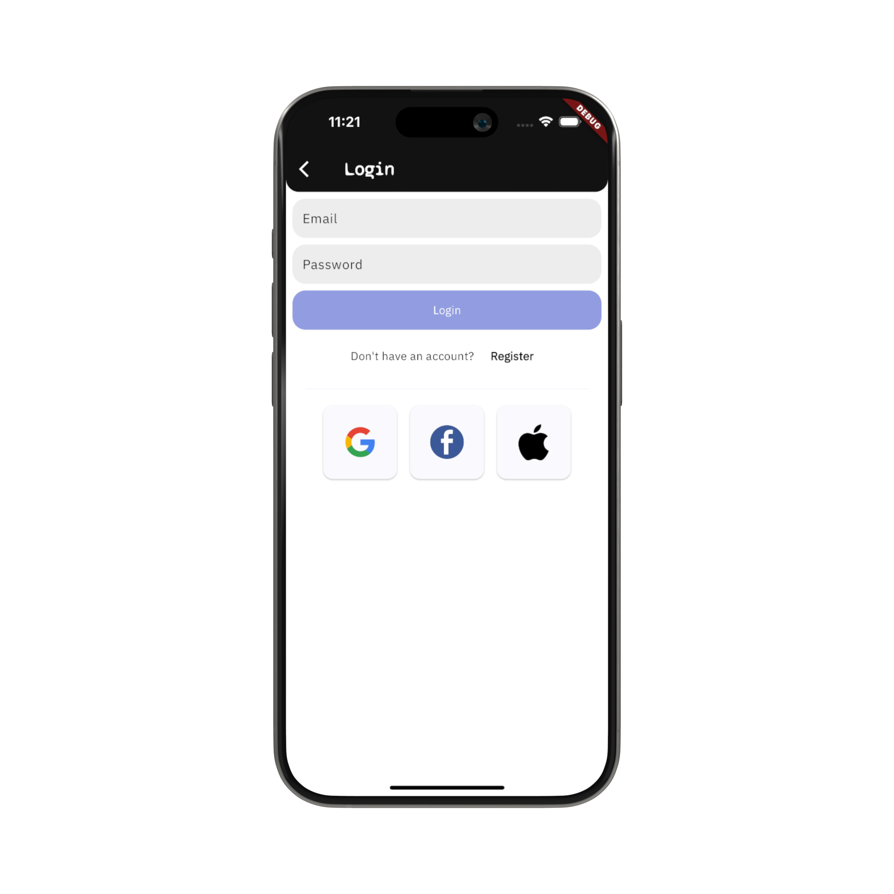
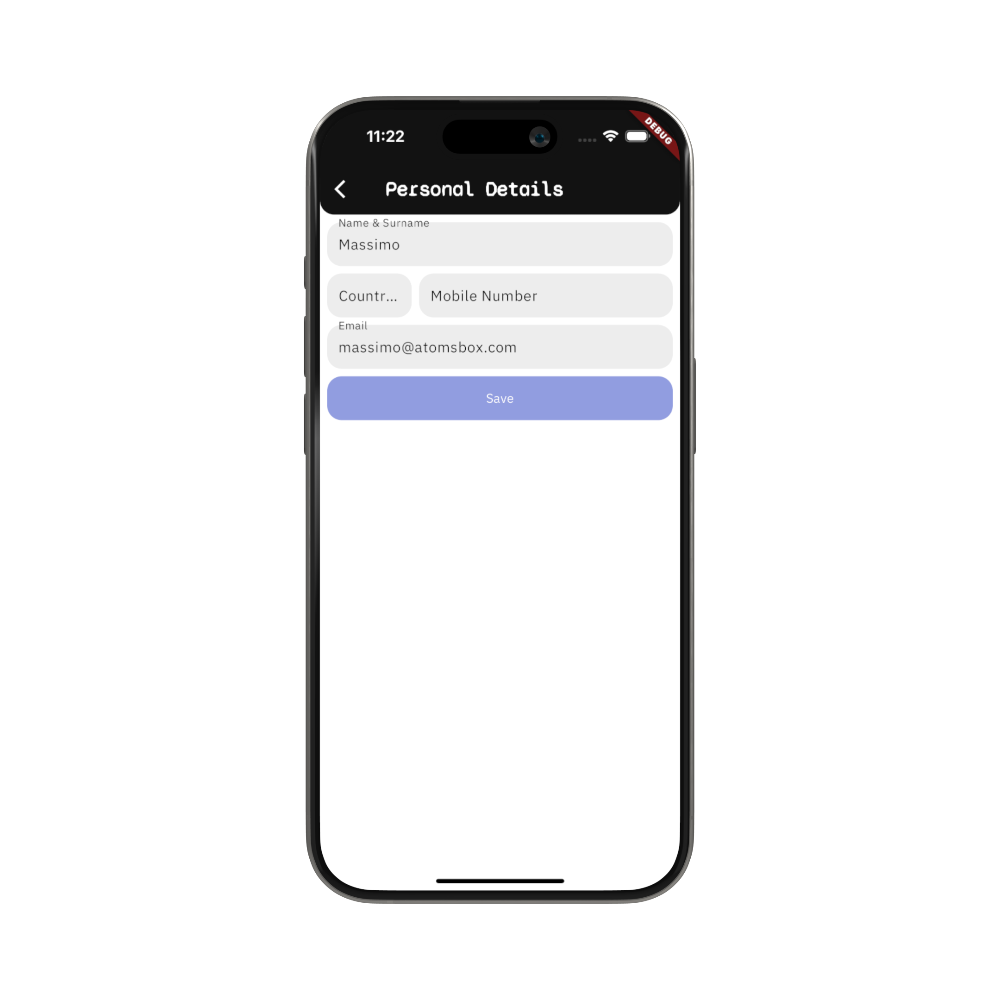
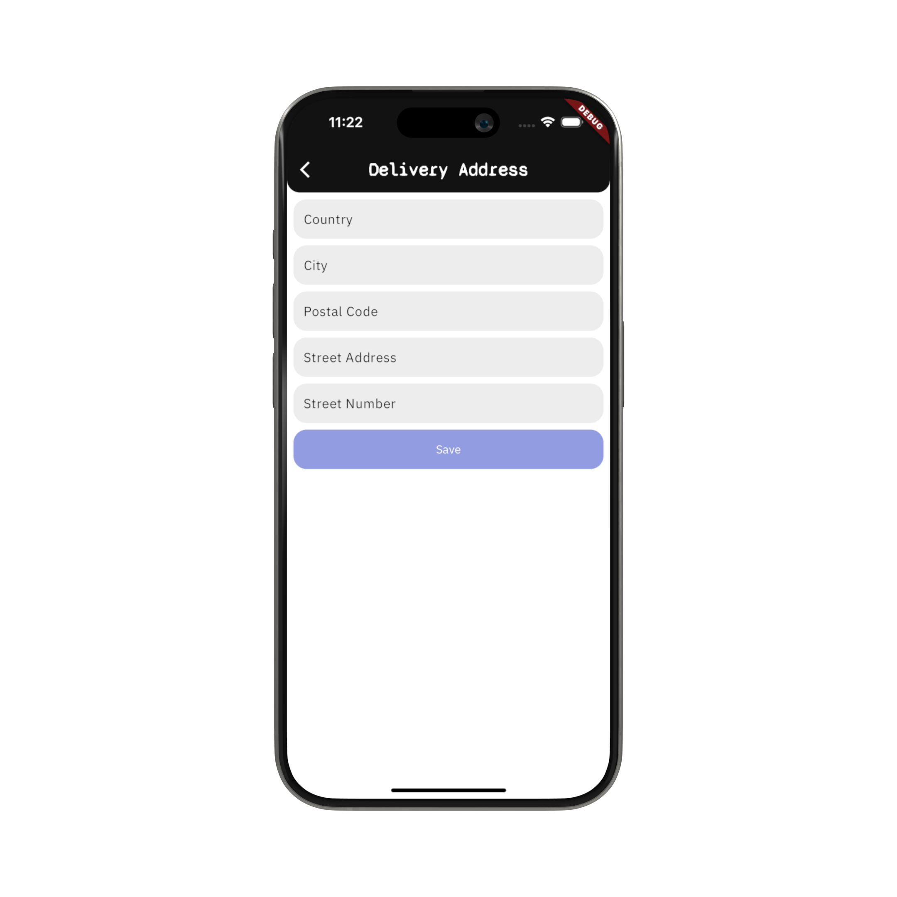

# eCommerce App with Flutter, Firebase and Stripe
The eCommerce App template gives you a simple, ready-to-use eCommerce app that you can customize for your projects. It is designed using Flutter and Firebase as a backend. In addition, it allows you to easily process payments using Stripe.

 

## Screens & UI Elements
Currently, the template includes ten screens:
- **Home screen**
- **Login screen**
- **Register screen**
- **Categories Screen**
- **Catalog Screen**
- **Product Screen**
- **User Account Screen**
- **Personal Details Screen**
- **Delivery Address Screen**
- **Checkout Screen**
- **Order History Screen** [Coming Soon]
- **Order Summary Screen** [Coming Soon]

## Screenshots
| |  |  |
|:---:|:---:|:---:|
| Home Screen | Categories Screen | Catalog Screen |
|  |  |  |
| Cart Screen | Checkout Screen | Product Screen|
|  |  |  |
| User Account Screen | Register Screen | Login Screen|
|  |  | |
| User Account Screen | Register Screen | |


## Getting Started
The template gives you a starting point for your e-commerce app project. 

To run the app with fake data and without connecting with Stripe and Firebase, create the .env file at the root level of the project. Update the values stored in the file. 

```
IS_MOCK=false
STRIPE_PUBLISHABLE_KEY=ADD-YOUR-KEY-HERE
```

Then, use the build_runner and envied to make these environment variables available to the project.

```shell
dart run build_runner build
```
At this point, you can run the app. It will run using sample data and fake implementation for the authentication service, the database and the payment integration. 

```shell
dart pub get
dart run
```

If you want to connect the app with Firebase and Stripe, there are a few steps you need to take to set up the connection. 

### Step 1: Firebase Set-Up
The template uses Firebase for Authentication, database and as well to run serverless backend logic with Cloud Functions.
1. Create a Firebase Project: Head to the Firebase Console and create a new project https://console.firebase.google.com/
2. Initialize Firebase Auth and enable the 'Email and Password' provider. 
3. Initialize a new database with Cloud Firestore
4. Initialize Firebase in your app. Follow these steps: https://firebase.google.com/docs/flutter/setup?platform=ios

### Step 2: Stripe Set-Up
The templates uses Stripe to handle all the payment processing needs. To integrate Stripe:
1. Create an account at stripe.com
2. Get the Stripe Publishable Key and the Secret Key: https://dashboard.stripe.com/test/apikeys (for test keys)
3. Add your Stripe Publishable Key as an environment variable in the .env file
    - Go in the .example.env, rename it to .env
    - Add the value of your Publishable Key.
    - Use the envied library to generate the file 'lib/env.g.dart':

```shell 
dart run build_runner build
```

4. Go to your Google Cloud Project (it gets created by default as you create a new Firebase project), and register the Stripe secret key with Secret Manager
    - Go to API & Services, click on "Enable APIs and Services" and enable the Secret Manager API 
    - Open Secret Manager in your Google Cloud Project
    - Create a new Secret with name equal to 'STRIPE_SECRET_KEY' and the Secret Key from Stripe as value

5. Set up the flutter_stripe library in your project, and implement the platform specific changes to implement. Follow the installation steps: https://pub.dev/packages/flutter_stripe#installation

### Step 3: Cloud Functions Set-Up
The template uses Cloud Functions on Firebase (with Python) to run the backend logic for the payments. 

1. Using the Firebase CLI, run: 
```shell 
firebase init functions 
```
2. Select your Firebase project
3. Select Python as a language for the functions
4. Use the script below for your main.py

```python
import stripe
import google.cloud.firestore
from firebase_admin import initialize_app, firestore
from firebase_functions import https_fn
from firebase_functions.params import SecretParam

STRIPE_SECRET_KEY = SecretParam('STRIPE_SECRET_KEY')

app = initialize_app()


@https_fn.on_request(secrets=[STRIPE_SECRET_KEY])
def stripe_create_payment_intent(req: https_fn.Request) -> https_fn.Response:
    print(req.method, req.get_json())
    if req.method != 'POST':
        return https_fn.Response(status=403, response='Forbidden!')

    data = req.get_json()


    # Extract individual variables from the payload
    payment_method_id = data.get('paymentMethodId')
    items = data.get('items')
    currency = data.get('currency')
    use_stripe_sdk = data.get('useStripeSdk')
    email = data.get('email')

    
    # Check if the customer exists in Stripe (if not, create a new one)
    customerParams = {'email': email}
    customers = stripe.Customer.list(api_key=STRIPE_SECRET_KEY.value, **customerParams).data

    if customers:
        # Existing customer
        customer = customers[0]
    else:
        # No customer exists, create a new one
        customer = stripe.Customer.create(
            api_key=STRIPE_SECRET_KEY.value,
            email=email,
            payment_method=payment_method_id,
            invoice_settings={
                'default_payment_method': payment_method_id,
            },
        )

    # Calculate the total price of the order
    totalPrice = _calculate_order_amount(items)

    try:
        if payment_method_id:
            paymentIntentParams = {
                'amount': totalPrice,
                'confirm': True,
                'customer': customer.id,
                'currency': currency,
                'payment_method': payment_method_id,
                'use_stripe_sdk': use_stripe_sdk,
                'automatic_payment_methods': {
                    'enabled': True,
                    'allow_redirects': 'never',
                },
            }

            intent = stripe.PaymentIntent.create(api_key=STRIPE_SECRET_KEY.value, **paymentIntentParams)
            return _generate_response(intent)
        else:
            return 'Bad Request', 400
    except Exception as e:
        return {'error': str(e)}, 400


def _calculate_order_amount(items):
    total_cost = 0

    firestore_client: google.cloud.firestore.Client = firestore.client()
    product_documents = firestore_client.collection('products').get()
    
    for doc in product_documents:
        doc_data = doc.to_dict()
        product_id = doc.id

        for item in items:
            if item['product'].get('id') == product_id:
                quantity = item['quantity']
                price = doc_data.get('price', 0)
                total_cost += price * quantity
    
    return int(total_cost * 100)
  

def _generate_response(intent):
    if intent.status == 'requires_action':
        return {
            'clientSecret': intent.client_secret,
            'requiresAction': True,
            'status': intent.status,
        }
    elif intent.status == 'requires_payment_method':
        return {
            'clientSecret': intent.client_secret,
            'error': 'Please provide a new payment method'
        }
    elif intent.status == 'succeeded':
        return {'clientSecret': intent.client_secret, 'status': intent.status}
    else:
        return {'error': 'Failed'}
```

5. Add Stripe as a dependency to your project
```shell
cd functions

# Start the virtual environment for the functions
source venv/bin/activate

# Add the dependency 
pip install stripe

# Update the list of dependencies in the requirements.txt
pip freeze > requirements.txt

# Close the virtual environment
deactivate

```

6. Deploy the functions to Firebase
```shell
firebase deploy --only functions
```


### Step 4: Set up the Cloud Firestore Data Bundles
The eCommerce loads the categories' data using a Data Bundle. The Cloud Firestore data are exported into a static data file using the Firestore Bundle Builder extension. 

1. Install the extension into your Firebase project: https://firebase.google.com/docs/extensions/official/firestore-bundle-builder
2. Follow the step by step tutorial to integrate the Firestore data bundles: https://www.youtube.com/watch?v=xYgIY_1ulhw&t=3100s


### Step 5: Update your .env file
You should have a .env file at the root level of your project. Update the values stored in the file. 
```
IS_MOCK=false
STRIPE_PUBLISHABLE_KEY=ADD-YOUR-KEY-HERE
```

Make sure to update the variables stored in `lib/env/env.g.dart`:

```shell
dart run build_runner build
```


## Features & Functionalities:
The existing codebase enables users to perform a variety of actions, including:

- Choosing product categories and browsing a list of products for the selected category.
- Viewing the product details and additional information/images for each product.
- Adding and removing products from the cart. 
- Creating an account and logging in with the email and password credentials. 
- Modifying their own information from the phone number to the delivery address.
- Checking out and paying for the order via credit card and the Stripe integration. 


If you're wondering how these feature are implemented in the template. Here's some details about the app's functionalities.

### State Management
The template uses the BLoC Pattern to separate the UI from the business logic. The app uses the flutter_bloc library to create BLoC (and/or Cubit) to handle inputs from the user and the application lifecycle and to present the data to the screens. Currently, it includes nine BLoCs/cubits:

- App BLoC: Handles the authentication status of the user and provides those information to any screen.
- Cart BLoC: Keep track of the product added to the cart and takes the user input to add and remove products. 
- Catalog BLoC: Retrieves the list of products to display to the user and make them available to the Catalog Screen.
- Categories BLoC: Retrieves the list of categories to display to the user and make them available to the Categories Screen.
- Checkout BLoC: Handle the user inputs to kickstart the payment process and helps displaying the payment flow results to the user. 
- Product BLoC: Start the process to fetch the selected product data and present them to the Product Screen
- User Account BLoC: Store the user information and takes the user inputs to update them (including phone number and address details).
- Login Cubit: Stores the user email and password and sends the request to login.
- Register Cubit: Stores the new user profile information and sends a request to create the account.


### Authentication Client (packages/auth_client)
The template has a local package to handle the user authentication process. The package offers two implementations: one connects the app with Firebase Auth, while the other provides a fake implementation with in-memory storage.

By default, the app uses the fake implementation, but you can switch to Firebase Auth as soon as you perform the steps to connect your app with your Firebase project (See the "Getting Started" section). 

### Database Client (packages/db_client)
The template has a local package to handle the interaction with a database.The package offers two implementations: one connects the app with Firebase Cloud Firestore, while the other provides a fake implementation with in-memory storage.

By default, the app uses the fake implementation, but you can switch to Cloud Firestore as soon as you perform the steps to connect your app with your Firebase project (See the "Getting Started" section). 
