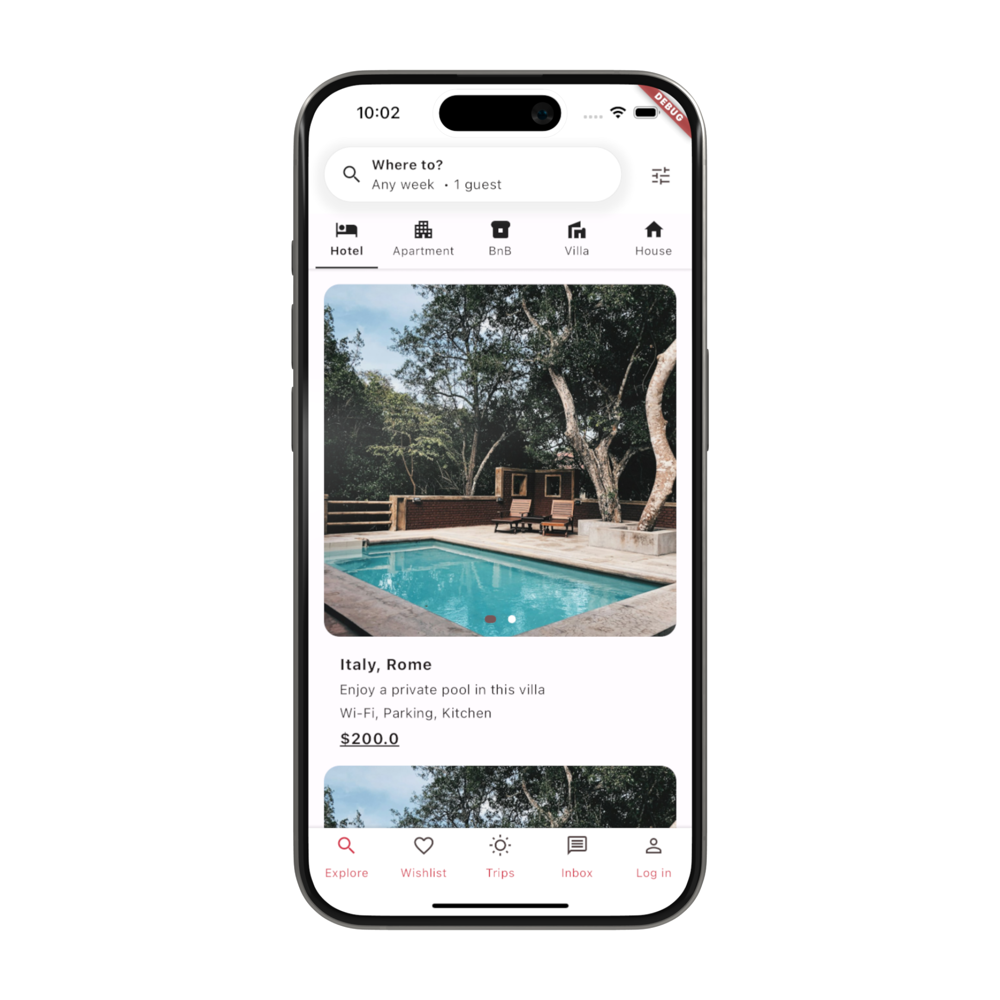
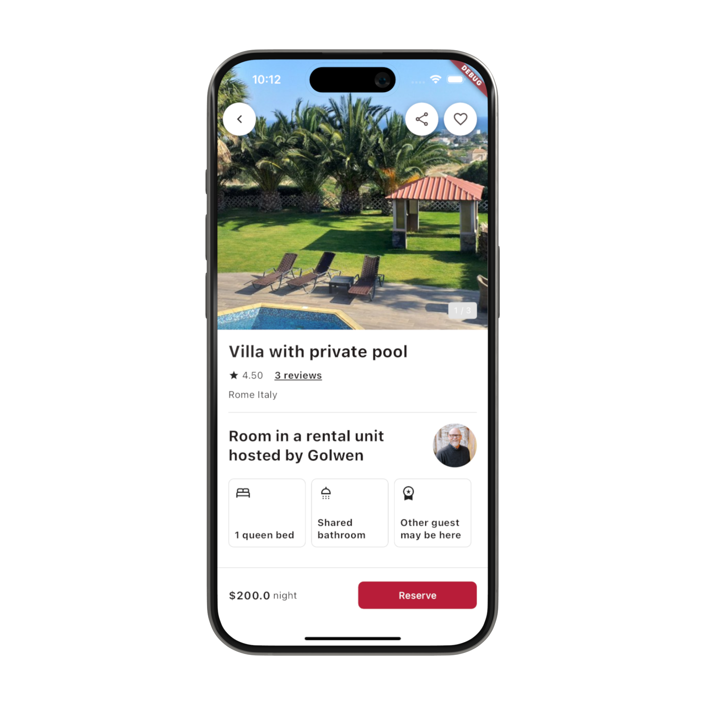
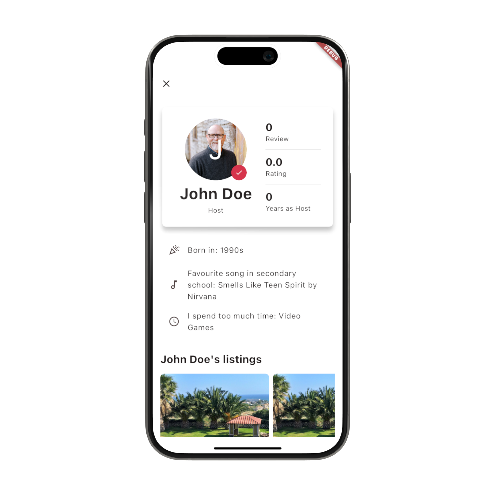
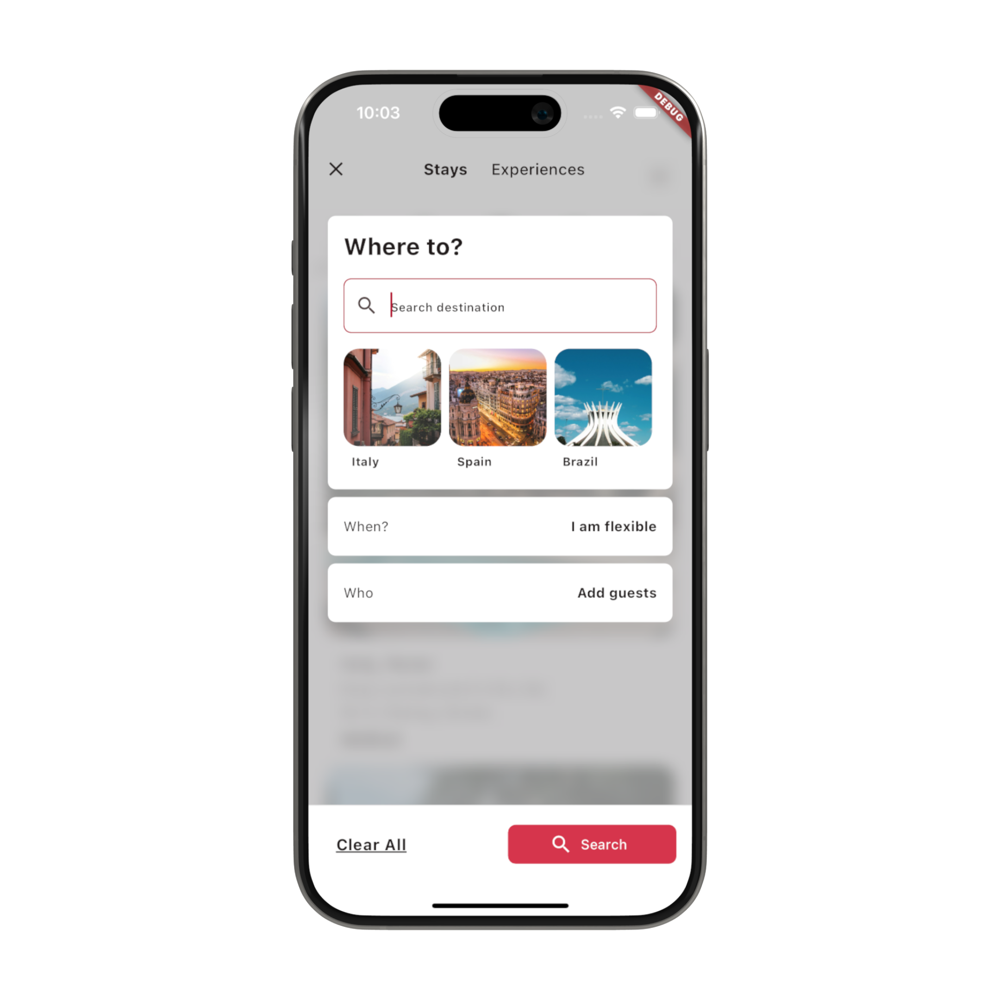
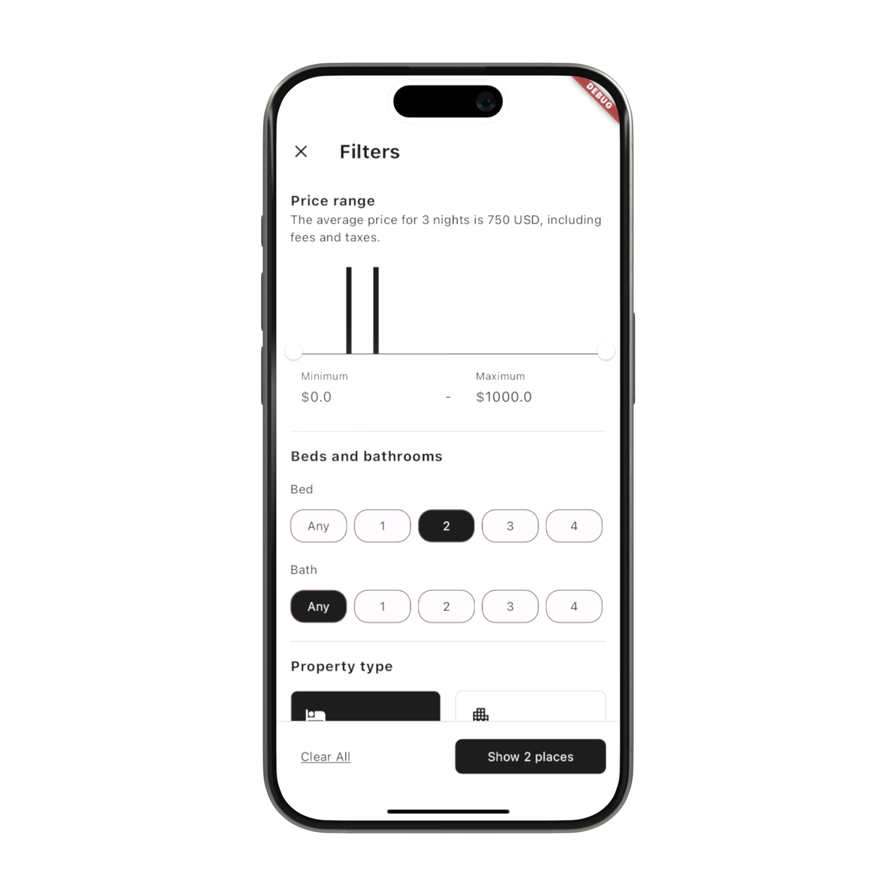
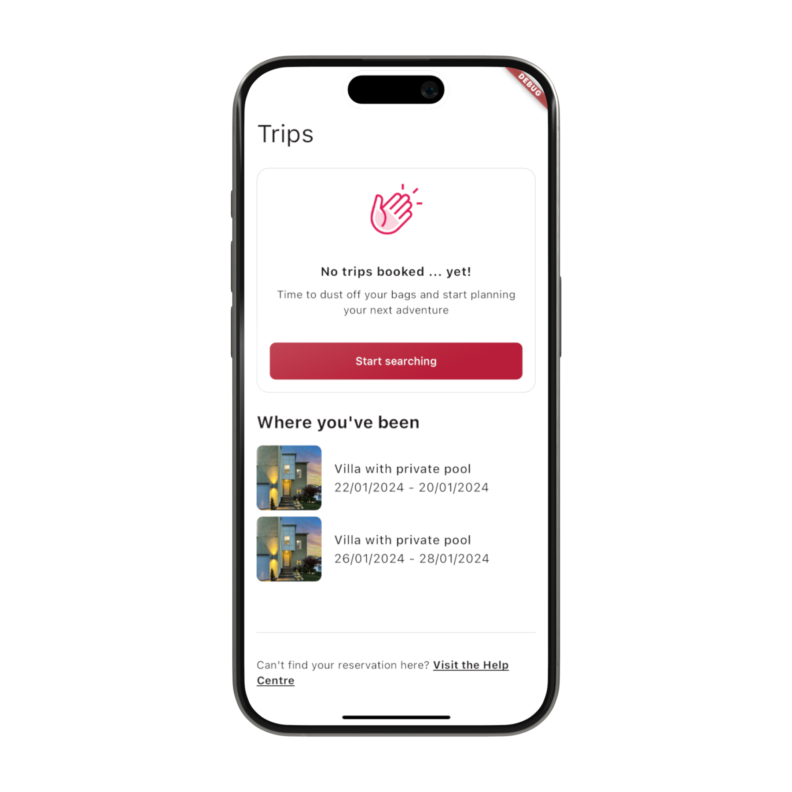
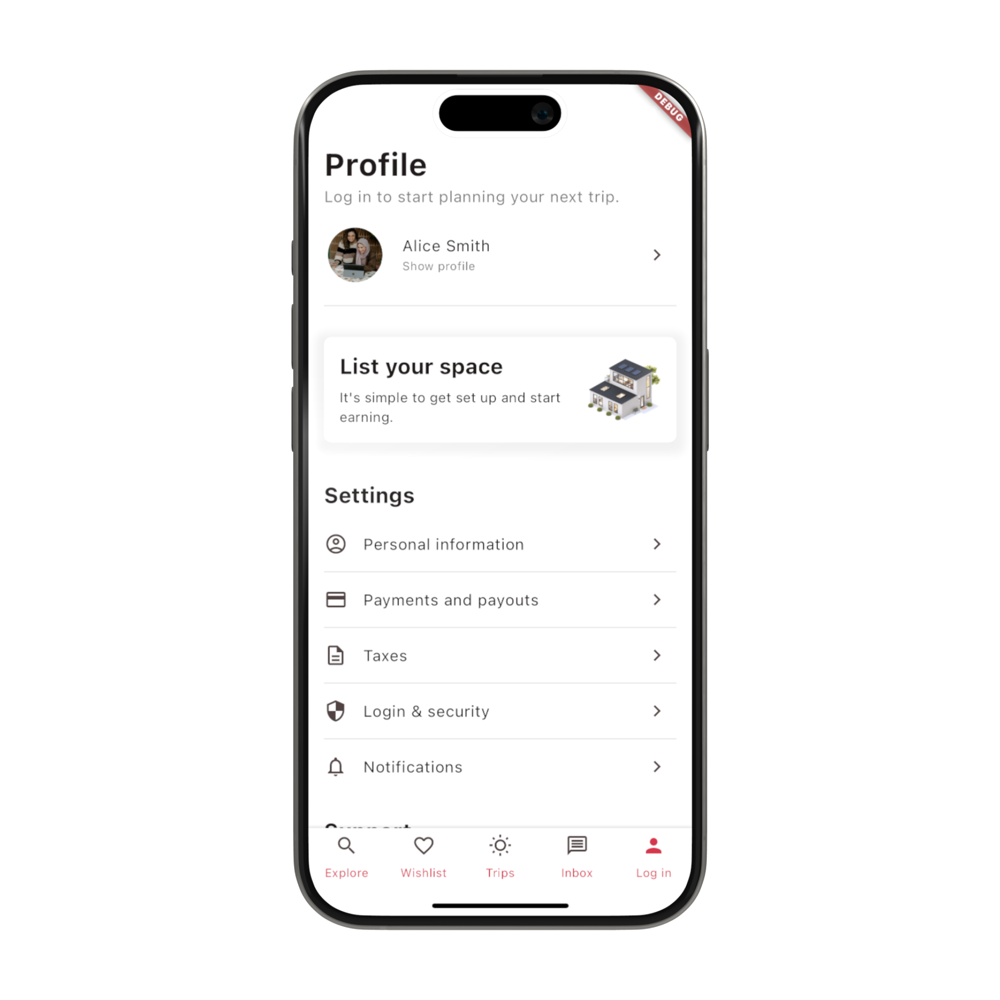
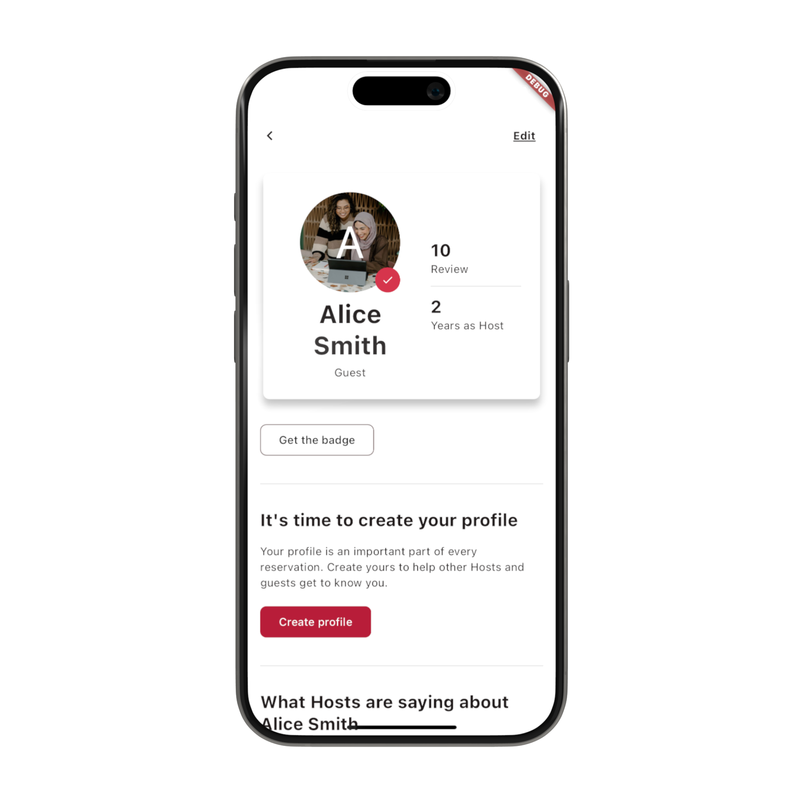
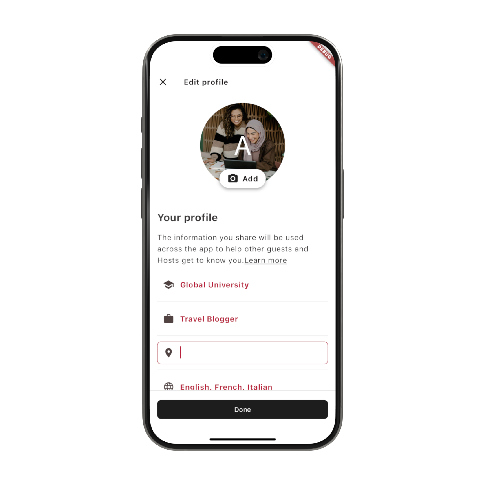

# Holiday Booking (AirBnB Clone)
The Holiday Booking App template is built with Flutter that aims to replicate the functionalities and the design of the popular short-term property booking app AirBnB. If you're keen on creating a holiday booking app, this template offers a head start without the need to build everything from scratch.


## Screens & UI Elements
Currently, the template includes nine screens:
- **Property listing screen**
- **Property details screen**
- **Host details screen**
- **Booking filters screen**
- **Booking filters (advanced) screen**
- **Booking history screen**
- **Profile screen**
- **Public profile screen**
- **Public profile edit screen**


## Screenshots
| |  |  |
|:---:|:---:|:---:|
| Property Listing Screen | Property Details Screen | Host Screen |
|  |  |  |
| Booking Filters Screen | Booking Filters (Advanced) Screen | Booking History Screen |
|  |  |  |
| Booking Summary Screen | Profile Screen | Public Profile Screen |
|  |  |  |
| Public Profile Edit Screen | |  |


## Features & Functionalities:
The existing codebase enables users to perform a variety of actions, including:
- Exploring a list of properties with the option to narrow down choices based on specific categories.
- Advanced filtering by applying detailed filters to refine property searches, including criteria like price range, number of bedrooms and bathrooms, property type, location, guest capacity, and available amenities.
- Browsing through a gallery of property images and access detailed information about each property.
- Viewing detailed profiles of the selected property host, including their information and other relevant details.
- Creating the user profile and updating the information that are displayed through the public user profile. 
- Accessing a list of all previous bookings made by the user

<br />
If you're wondering how these feature are implemented in the template. Here's some details about the app's functionalities.

### State Management
The template uses the BLoC Pattern to separate the UI from the business logic. The app uses the flutter_bloc library to create BLoC (and/or Cubit) to handle inputs from the user and the application lifecycle and to present the data to the screens. Currently, it includes six BLoCs/cubits:
- **App BLoC**: Handles the authentication status of the user and provides those information to any screen.
- **Booking Filters BLoC**: Controls the filters selected by the users, allowing filtering the properties.
- **Booking History BLoC**: Retrieves and stores the booking history of the user.
- **Host Details BLoC**: Retrieves and stores the user information of the host for a given property.
- **Property Listing BLoC**: Retrieves the list of properties to display to the user (filtered based on the filters selection).
- **Property Details BLoC**: Presents the property data to the Property Details Screen. 
- **User Profile BLoC**: Store the user information and takes the user inputs to update them. 


### Database Client (packages/db_client)
The template has a local package to handle the interaction with a database. The package has a local in-memory implementation with a fake data source that contains the sample data to run the application. 

### Navigation
The navigation between screens is implemented using GoRouter. 

### Localization (l10n)
The template is designed with global accessibility in mind. It utilizes the flutter_localizations package that enables the localization of strings and various values to target multiple languages and locales. All the app's hardcoded strings are initially provided in English and added in the lib/l10n/app_en.arb file. Optionally, you can include additional translations based on your specific requirements. 


## Getting Started
To run the template, follow these steps. 

### Step 1: 
- Go to the root level of the project. Then, add the dependencies: 
```dart
flutter pub get
```

### Step 2: 
- Start the iOS simulator or the Android emulator, and run the application:
```dart 
flutter run
```
