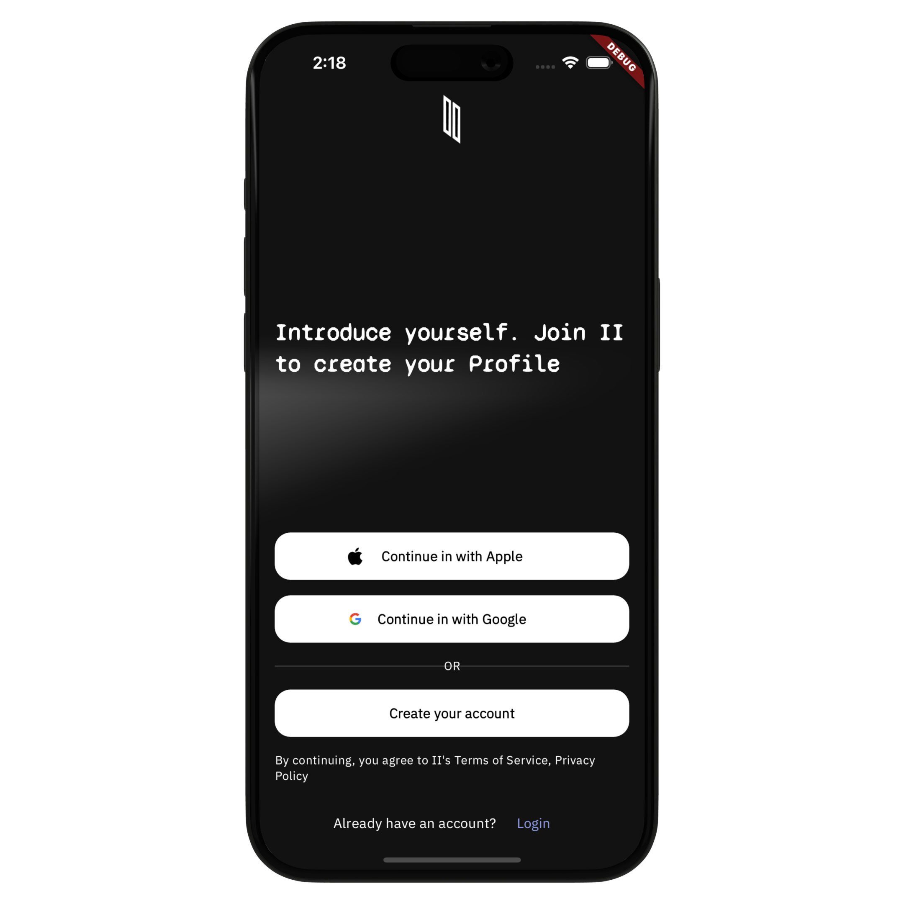
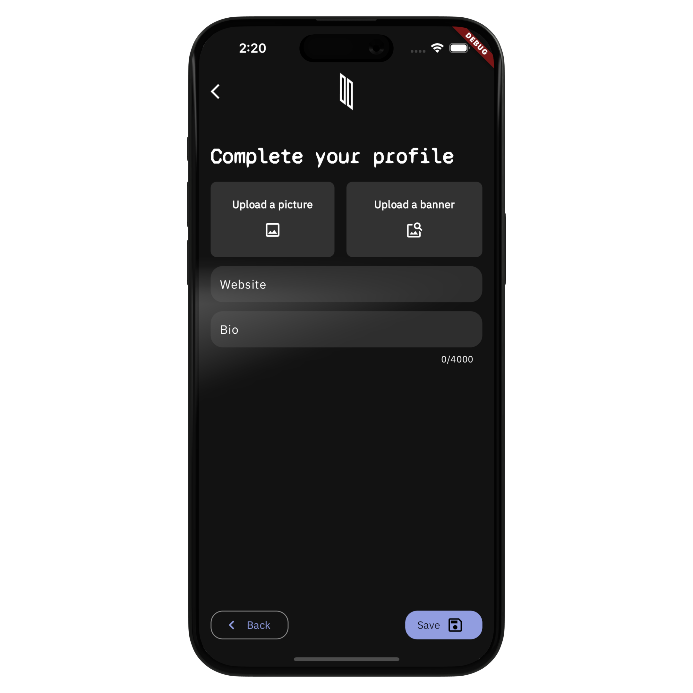
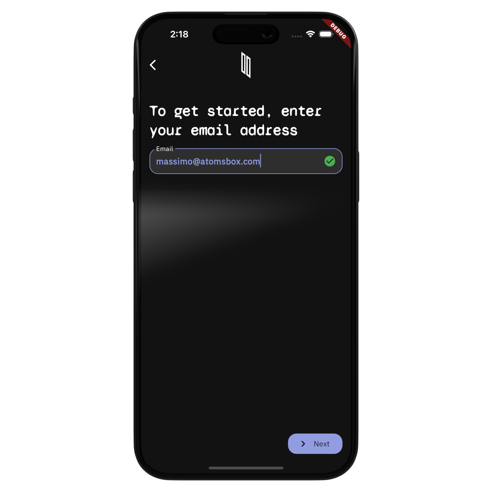
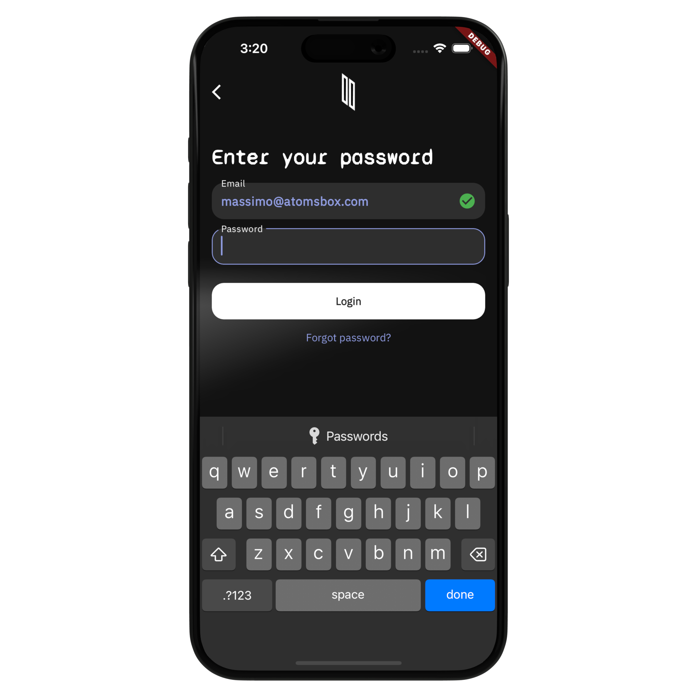
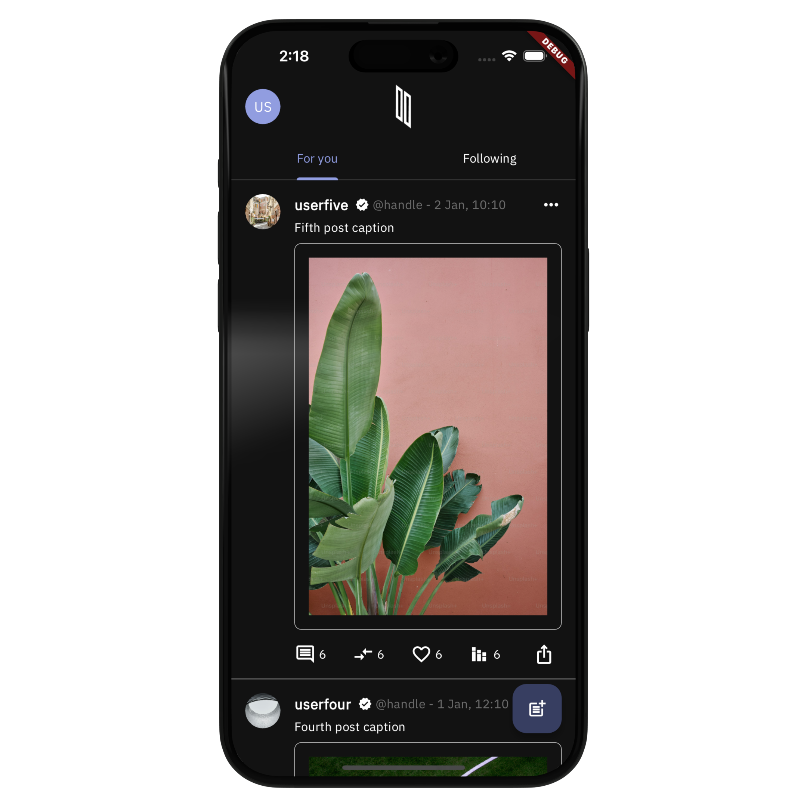
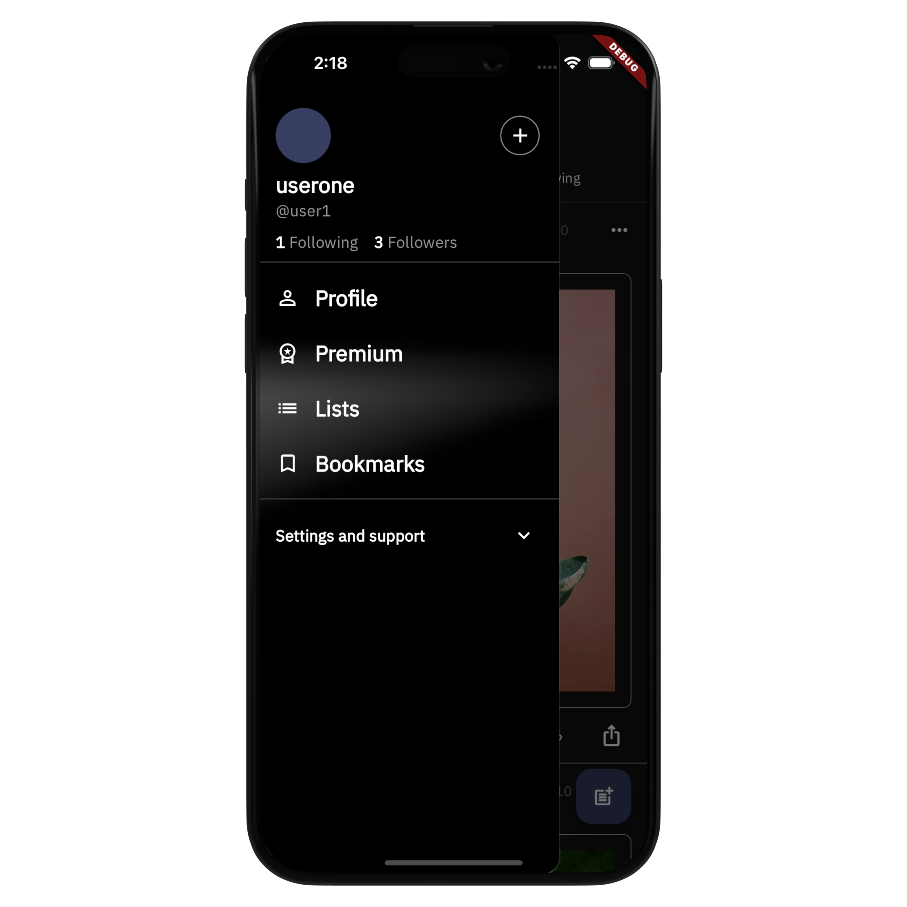
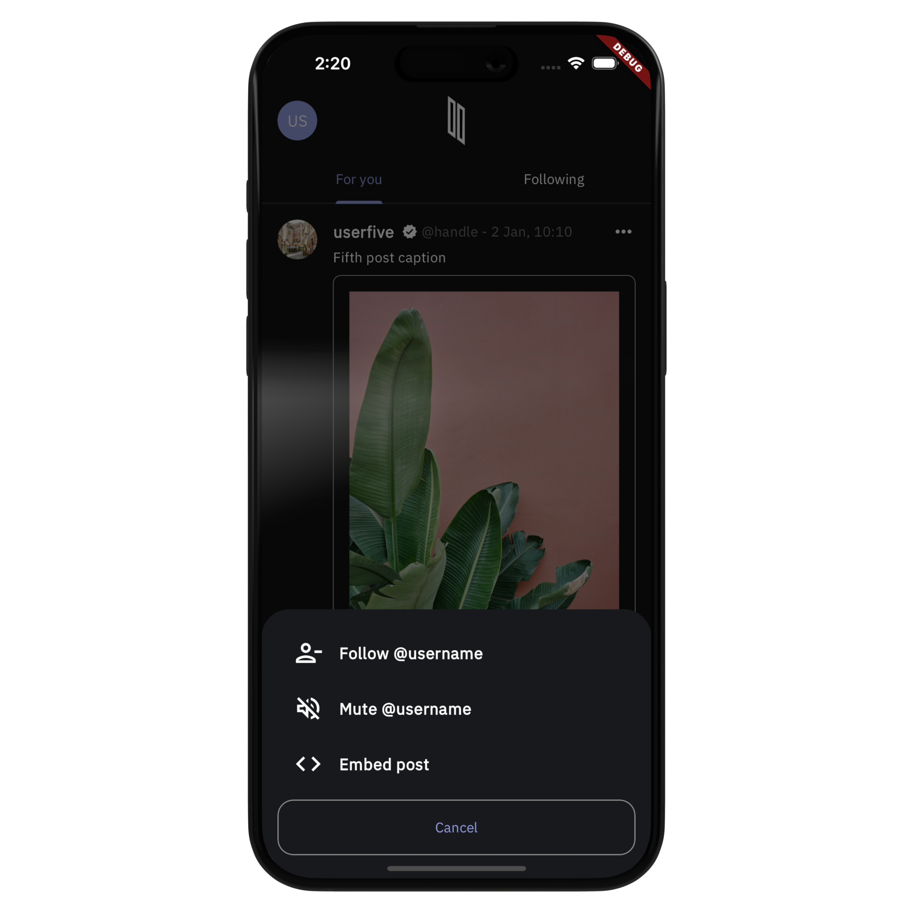
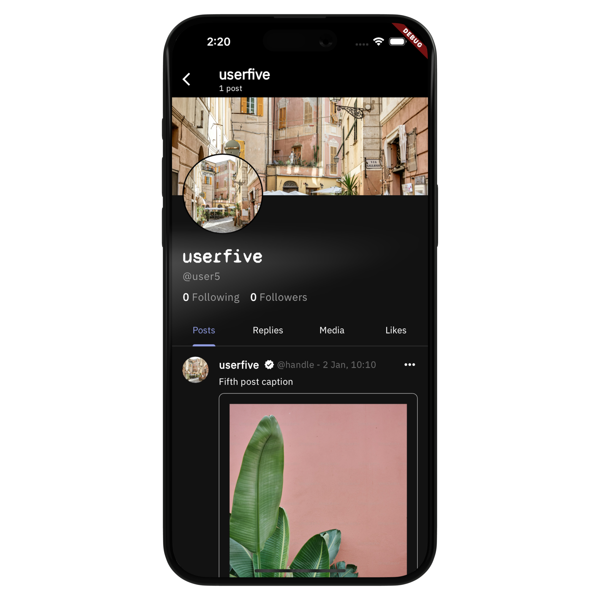

# Social Media (X Clone) App
The Social Media (X Clone) App template is built with Flutter and gives you a codebase designed to mimic the core features of a popular social media platform ('X'). This template is a starting point for developers looking to create a social media app without building everything from scratch.


## Screens & UI Elements
Currently, the template includes eight screens:
- **Onboarding screen**
- **Login screen (2 pages)**
- **Register screen (2 pages)**
- **Feed screen**
- **User profile screen**
- **Edit user profile screen**
- **Followings and followers screen**
- **Create post screen**


## Screenshots
| |  |  |
|:---:|:---:|:---:|
| Onboarding Screen | Register Screen (1) | Register Screen (2) |
| |  |  |
| Login Screen (1) | Login Screen (2) |  Onboarding Screen |
| |  |  |
| Feed Screen (Drawer) | Feed Screen (User Actions) | User Profile Screen |


## Features & Functionalities:
The existing codebase enables users to perform a variety of actions, including:
- Registering an account by providing personal details.
- Loggin in using their email and password.
- Browsing a list of post in the "For you" and in the "Following" feeds.
- Creating new posts with the option to include images or text.
- Setting privacy controls for their posts, including who can see and respond to them.
- Viewing their profile and their own post
- Updating their profile information, including changing their profile image and/or banners
- Viewing their list of followers and following, and navigating to their profiles

<br />
If you're wondering how these feature are implemented in the template. Here's some details about the app's functionalities. 

### State Management
The template uses the BLoC Pattern to separate the UI from the business logic. The app uses the flutter_bloc library to create BLoC (and/or Cubit) to handle inputs from the user and the application lifecycle and to present the data to the screens. Currently, it includes six BLoCs/cubits:
- **App BLoC**: Handles the authentication status of the user and provides those information to any screen.
- **Create Post Cubit**: Controls the user input from the Create Post screen and starts the new post creation process. 
- **Login Cubit**: Stores the user email and password and sends the request to login.
- **Register Cubit**: Stores the new user profile information and sends a request to create the account. 
- **Feed BLoC**: Retrieves the list of posts to display to the user and make them available to the Feed Screen.
- **User Profile BLoC**: Presents the user data to the User Profile Screen and handles the user requests to update those information. 


### Authentication Client (packages/auth_client)
The template has a local package to handle the user authentication process. The package has a fake implementation that allows the user to login and register with email and password, but it is not connected with any real authentication provider. 

### Database Client (packages/db_client)
The template has a local package to handle the interaction with a database. The package has a local in-memory implementation with a fake data source that contains the sample data to run the application. 

### File Upload Client (packages/file_upload)
The template has a local package to allow users to upload images from their devices to the application. It uses the image_picker plugin to select an image from the user gallery. Images are picked from the local device, however, they are not upladed to any cloud storage solution. 

### Navigation
The navigation between screens is implemented using GoRouter. 

### Localization (l10n)
The template is designed with global accessibility in mind. It utilizes the flutter_localizations package that enables the localization of strings and various values to target multiple languages and locales. All the app's hardcoded strings are initially provided in English and added in the lib/l10n/app_en.arb file. Optionally, you can include additional translations based on your specific requirements. 


## Getting Started
To run the template, follow these steps. 

### Step 1: 
- Go to the root level of the project. Then, add the dependencies: 
```dart
flutter pub get
```

### Step 2: 
- Start the iOS simulator or the Android emulator, and run the application:
```dart 
flutter run
```


